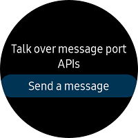
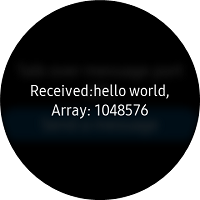
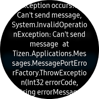

# MessagePortSampleApp #

MessagePortSampleApp sample app demonstrates how to send and receive messages between applications.

 - Send a message to Tizen .Net Service sample app when `Send a message` button is clicked.

   

 - Receive a message from [Tizen .Net Service sample application](https://github.com/Samsung/Tizen-CSharp-Samples/tree/master/Wearable/ServiceApp)

   

### Prerequisites
First of all, you need to install and execute [Tizen .Net Service sample application](https://github.com/Samsung/Tizen-CSharp-Samples/tree/master/Wearable/ServiceApp) because it is used to communicate each other.

You can install *Tizen .Net service application* by 

 - using `Visual Studio` 
 - using the `sdb` command line as follows:

        $ sdb install org.tizen.example.ServiceApp-1.0.0.tpk
        $ sdb shell
        $ app_launcher -s org.tizen.example.ServiceApp        // launch a service app

If you do not install `Tizen .Net service application`, an exception occurs when you press `Send a message` button.

   

This application uses Tizen.Application.Messages API.

* [Class MessagePort][MessagePort]

In addition, there is a similar native sample application.

* [Tizen Native version](https://developer.tizen.org/development/sample/native/AppFW/%28Tutorial%29_Message_Port)

   [MessagePort]: <https://developer.tizen.org/dev-guide/csapi/api/Tizen.Applications.Messages.MessagePort.html>

